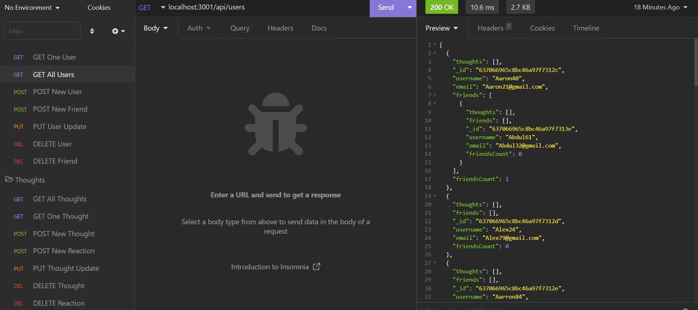
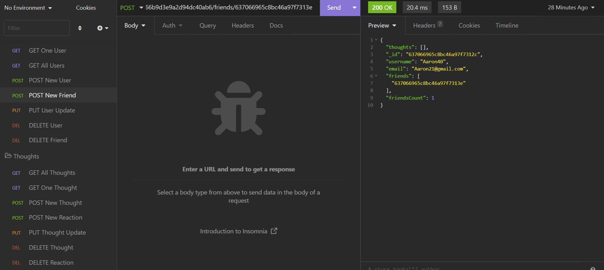
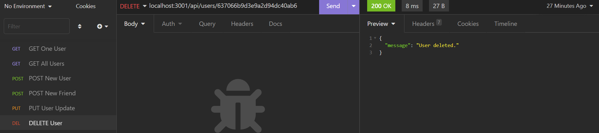
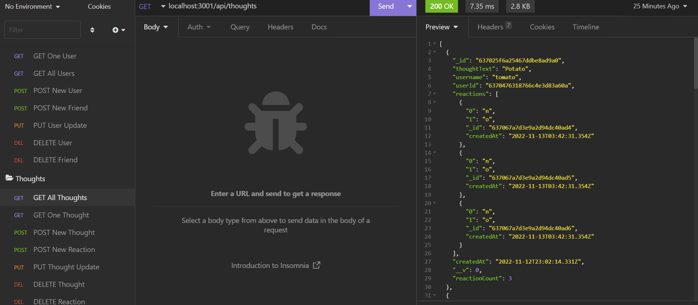
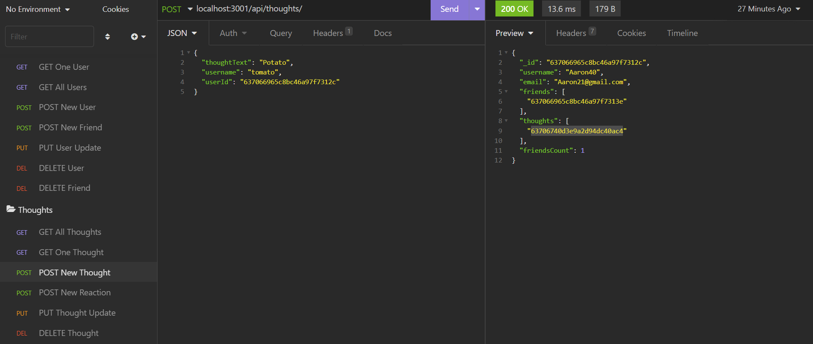
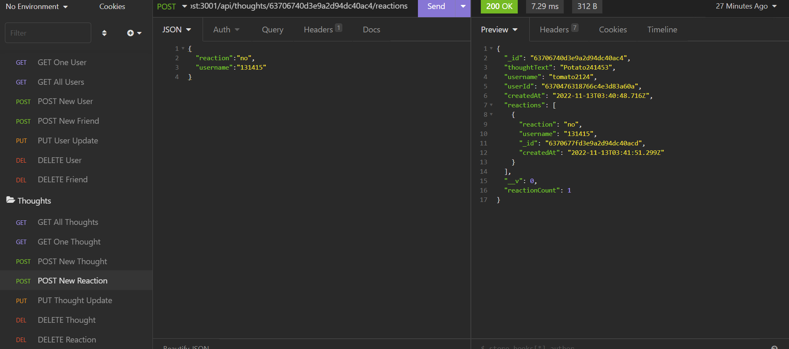

# Social Media Back End

## Introduction

The backend routes and controllers for a hypothetical social media website including users, friends, posts, and post reactions.

## Table of Contents 
1. [Installation](#installation)
2. [Usage](#usage)
3. [Test](#test)
4. [Images](#images)
5. [Credits](#credits)
6. [Licenses](#licenses)

## Installation 

1. Clone data from the github repository, found using the link, https://github.com/EllisJLC/SocialMedia_BackOnly. 
2. Seed data by inputing `node utils/seed.js` to populate database.
3. Run `npm install` to install necessary npm packages.

## Usage

Back end connections for a social media website

## Test

1. Run program by inputting npm start. 
2. Test connections by using insomnia to send HTTPS requests.

Demonstration: https://youtu.be/zp7NbP6CdrE.

## Images

### GET request for all users

### POST request for new friend

### DELETE request for specified user

### GET request for all thoughts

### POST request for new thought

### POST request for new reaction

## Credits

All code was written by Jia Liang (Ellison) Chen, https://github.com/EllisJLC.

## Licenses 

The MIT License: https://opensource.org/licenses/MIT